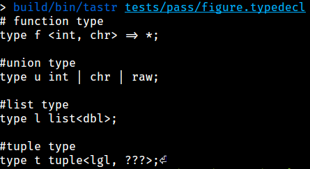
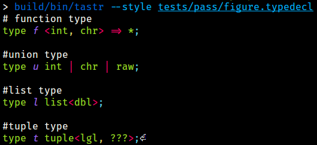
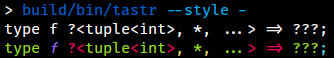
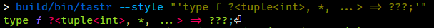
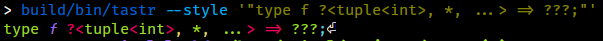
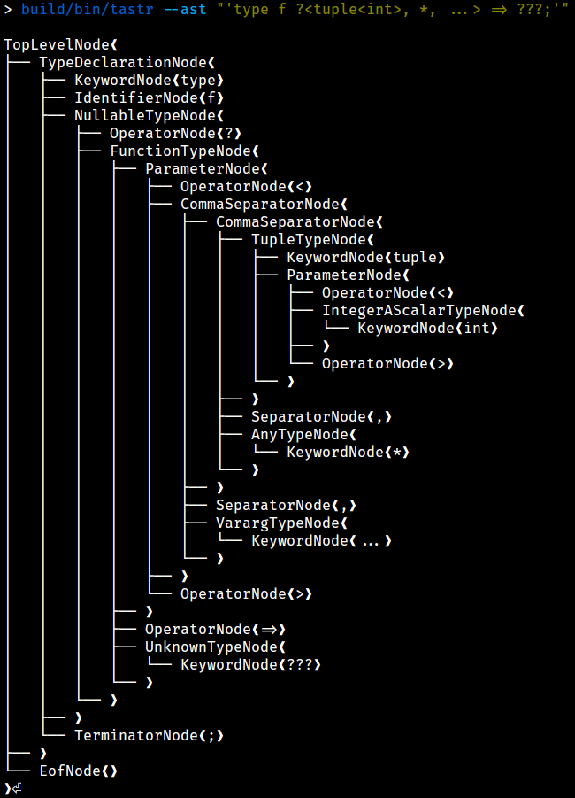
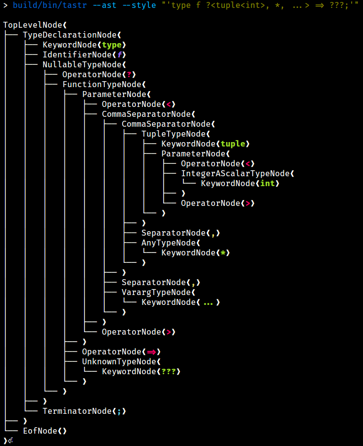

# tastr: Type AST for R

[](https://opensource.org/licenses/Apache-2.0)
[](https://travis-ci.org/aviralg/tastr)

`tastr` is a library that implements a grammar for R types. It provides functions to parse types from input streams (files, strings, etc.) to C++ objects. It also provides the reverse functionality to unparse these objects. 
The Type AST is modeled using C++ classes. The design relies heavily on unique ownership, i.e., an AST node holds unique references to its child nodes.
The grammar is implemented using [`flex`](https://westes.github.io/flex/manual/) and [`bison`](https://www.gnu.org/software/bison/manual/bison.html).

## Installation

To obtain the project source, run:

`$` `git clone https://github.com/aviralg/tastr.git`

To build the project, run:

`$` `make`

This will build the following artifacts:
- **Static library**: `build/lib/libtastr.a`
- **Shared library**: `build/lib/libtastr.so`
- **Executable**:     `build/bin/tastr`

To clean the build artifacts, run:

`$` `make clean`


To execute tests, run:

$ make test

For building and testing in parallel, invoke `make` with `-j` flag.

## Usage

The `tastr` executable (`build/bin/tastr`) parses type declarations from different sources and unparses them back.

```
> build/bin/tastr --help
Parse type declarations.
Usage:
tastr [OPTION...]

-h, --help    Print usage
-l, --lexer   Debug lexer
-p, --parser  Debug parser
-a, --ast     Show AST structure
-s, --style   Style output
```

### Render input

Pass the filename to render the input as is (retains spaces, newlines and comments):



Pass `--style` flag to render with styling.



To read the input from stdin pass `-` argument (press `Ctrl-D` to simulate end of input).



Input can also be directly parsed from the argument if it is quoted using `"` or `'`.






### View AST structure

Use `--ast` flag to view the ast structure without any styling.



Use `--style` flag along with `--ast` to view the ast structure with styling.




## Type Grammar

```

<integer>: "integer"
         | "int"
         | "i"

<double>: "double"
        | "dbl"
        | "d"

<complex>: "complex"
         | "clx"
         | "x"

<character>: "character"
           | "chr"
           | "s"

<logical>: "logical"
         | "lgl"
         | "l"

<raw>: "raw"
     | "r"

<ascalar>: <integer>
         | <double>
         | <complex>
         | <character>
         | <logical>

<nascalar>:  "^" <ascalar>

<scalar>: <ascalar>
        | <raw>
        | <nascalar>

<environment>: "environment"
             | "env"
             | "t"

<expression>: "expression"
            | "exr"
            | "e"

<language>: "language"
          | "lng"
          | "g"

<symbol>: "symbol"
        | "sym"
        | "y"

<externalptr>: "externalptr"
             | "ept"
             | "p"

<bytecode>: "bytecode"
          | "bcd"
          | "b"

<pairlist>: "pairlist"
          | "plt"

<s4>: "s4"

<weakref>: "weakref"
         | "wrf"
         | "w"

<any>: "any"
     | "*"

<unknown> : "???"

<vector>: <scalar> "[" "]"

<list>: "list" "<" <type> ">"
      | "lst" "<" <type> ">"

<struct>: "struct" "<" <namedtypeseq> ">"
        | "srt" "<" <namedtypeseq> ">"

<tuple>: "tuple" "<" <typeseq> ">"
       | "tpl" "<" <typeseq> ">"


<function>: <params> "=>" <type>

<typeseq>: <type>
         | <typeseq> "," <type>

<namedtype>: <identifier> ":" <type>

<namedtypeseq> : <namedtype>
               | <namedtypeseq> "," <namedtype>

<param>: <type>
       | "..."

<paramseq>: <param>
          | <paramseq> "," <param>

<params>: "<" <paramseq> ">"
        | "<" ">"


<group>: "(" <type> ")"

<nonunion>: <scalar>
          | <environment>
          | <expression>
          | <language>
          | <symbol>
          | <externalptr>
          | <bytecode>
          | <pairlist>
          | <s4>
          | <weakref>
          | <vector>
          | <function>
          | <list>
          | <struct>
          | <tuple>
          | <group>

<union>: <nonunion>
       | <union> "|" <nonunion>

<null>: "?"
      | "?" <union>

<type>: <union>
      | <null>
      | <any>
      | <unknown>

<decl>: "type" <identifier> <type> ";"

<declseq>: <decl>
         | <declseq> <decl>

```


## Useful Resources

### Bison and Flex
- [Flex Token Order](https://stackoverflow.com/questions/22444094/flex-token-order)
- [UTK Bison Notes](http://web.eecs.utk.edu/~bvanderz/teaching/cs461Sp11/notes/bison/)
- [Parsing rule for empty files](https://stackoverflow.com/questions/11047227/no-error-while-parsing-empty-file-yacc-lex)
- [Dynamic file loading in Flex](https://stackoverflow.com/questions/31839746/loading-external-files-flex-bison-yyin)
- [Redefine `YY_INPUT` in Flex](https://stackoverflow.com/questions/1920604/how-to-make-yy-input-point-to-a-string-rather-than-stdin-in-lex-yacc-solaris)
- [C++ istream with Flex](https://stackoverflow.com/questions/9628099/c-istream-with-lex)
- [Bison/Flex Example](https://github.com/ezaquarii/bison-flex-cpp-example)
- [Read from C++ streams in Flex](https://stackoverflow.com/questions/780676/string-input-to-flex-lexer)
- [Lex and Yacc Tutorial](https://www.epaperpress.com/lexandyacc/index.html)
- [Parsing strings in Flex](http://dinosaur.compilertools.net/flex/flex_11.html)
- [Bison/Flex Example](https://coldfix.eu/2015/05/16/bison-c++11/)
- [Unique Pointer as a Semantic Value in Bison](http://www.comrite.com/wp/c11-stdunique_ptr-as-semantic-value-in-bison-c-mode/)
- [Resolving Grammar Conflicts](https://efxa.org/2014/05/17/techniques-for-resolving-common-grammar-conflicts-in-parsers/)
- [Bison/Flex Example](http://www.kylheku.com/cgit/txr/tree/parser.l)
- [Bison/Flex Example](http://www.jonathanbeard.io/tutorials/FlexBisonC++)
- [Bison/Flex Example](http://panthema.net/2007/flex-bison-cpp-example/)
- [Bison/Flex Example](https://panthema.net/2007/flex-bison-cpp-example/flex-bison-cpp-example-0.1/doxygen-html/index.html)
- [Bison/Flex Example](https://github.com/EmilGedda/Leonardo)

### C++: Unique Pointers and Polymorphism
- [Arguments and Unique Pointers](https://vladris.com/blog/2016/03/11/arguments-and-smart-pointers.html)
- [Smart Pointer Parameters](https://herbsutter.com/2013/06/05/gotw-91-solution-smart-pointer-parameters/)
- [Move Constructors and Multiple Inheritance](https://stackoverflow.com/questions/10114701/move-constructors-and-multiple-inheritance)
- [Copy Constructors and Unique Pointer](https://stackoverflow.com/questions/16030081/copy-constructor-for-a-class-with-unique-ptr)
- [Rules for Smart Pointers](https://www.modernescpp.com/index.php/c-core-guidelines-rules-to-smart-pointers)
- [Using Smart Pointers as Class Members](https://stackoverflow.com/questions/15648844/using-smart-pointers-for-class-members)
- [Cloning, Covariant Return and Smart Pointer](https://www.fluentcpp.com/2017/09/12/how-to-return-a-smart-pointer-and-use-covariance/)
- [How I Declare my Class and Why](http://howardhinnant.github.io/classdecl.html)
- [Polymorphic Cloning and CRTP](https://katyscode.wordpress.com/2013/08/22/c-polymorphic-cloning-and-the-crtp-curiously-recurring-template-pattern/)
- [Delegating Constructors](https://arne-mertz.de/2015/08/new-c-features-inherited-and-delegating-constructors/)
- [`==` operator and Polymorphism](https://stackoverflow.com/a/565785)
- [Move constructors and inheritance](https://stackoverflow.com/questions/15351341/move-constructors-and-inheritance)
- [Move assignment operator and inheritance](https://stackoverflow.com/questions/50854598/inheritence-of-the-move-assignment-operator-in-c)
- [Move assignment on self](https://stackoverflow.com/questions/9322174/move-assignment-operator-and-if-this-rhs)
- [C++ `final` keyword](https://smartbear.com/blog/develop/use-c11-inheritance-control-keywords-to-prevent-in/)

### Make and Code Compilation
- [Compiling a static library in linux](https://stackoverflow.com/questions/2734719/how-to-compile-a-static-library-in-linux)
- [Compiling C/C++ software](https://gist.github.com/gubatron/32f82053596c24b6bec6)

### R
- [Various uses of quoting in R](https://stat.ethz.ch/R-manual/R-devel/library/base/html/Quotes.html)

### Miscellaneous
- [Unicode Characters in the 'Punctuation, Open' Category](https://www.fileformat.info/info/unicode/category/Ps/list.htm)
- http://www.fileformat.info/info/unicode/block/control_pictures/images.htm
- https://www.htmlsymbols.xyz/arrow-symbols


## TODO

1. Check `clone_impl`, it should be empty for abstract base classes and defined for concrete classes.

    \\u[0-9A-Fa-f]{1,4}     { get_identifier().push_back(yytext); }
    \\U[0-9A-Fa-f]{1,8}     { get_identifier().push_back(yytext); }
    \\u{LBRACE}[0-9A-Fa-f]{1,4}{RBRACE} { get_identifier().push_back(yytext); }
    \\U{LBRACE}[0-9A-Fa-f]{1,8}{RBRACE} { get_identifier().push_back(yytext); }


    \\[0-7]{2}              { get_identifier().append("0"); get_identifier().push_back(yytext[1]); get_identifier().push_back(yytext[2]); }
    \\[0-7]{3}              { get_identifier().append(yytext); }
